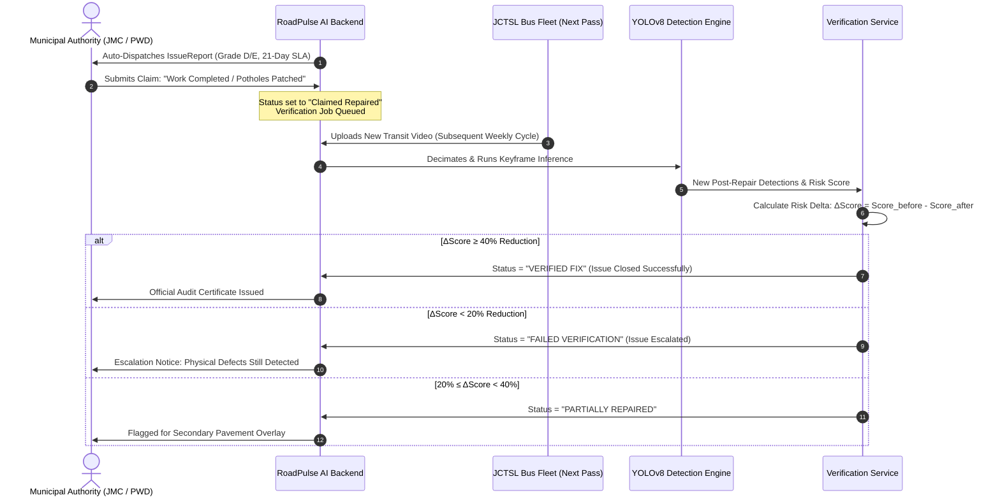

# RoadPulse AI — Complete End-to-End System Pipeline & Architecture

> **"From Road Detection to Road Accountability"**  
> A detailed technical breakdown of the 10-step autonomous pipeline powering RoadPulse AI—from electric city bus edge video capture to deep learning inference, spatial clustering, multi-criteria risk scoring, municipal SLA dispatch, and closed-loop AI repair verification.

---

## 1. High-Level Architecture & Pipeline Flowchart

RoadPulse AI leverages existing public transit fleets (e.g., Jaipur City Transport Services Limited / JCTSL) as continuous mobile scanning sensors. Instead of deploying expensive dedicated road survey vehicles, the platform ingests forward-facing pavement footage from electric buses, extracts keyframes, performs computer vision inference, clusters detections across trips, computes road degradation indices, and enforces civic accountability.

```mermaid
flowchart TD
    subgraph Fleet["1. Fleet Video Capture"]
        BUS["🚌 JCTSL Electric Bus Fleet<br/>Routes 11, 12, 13"]
        CAM["📷 Forward NVDR Dashcam<br/>1080p / 4K @ 30 FPS"]
        BUS --> CAM
    end

    subgraph Ingestion["2. Depot Transfer & Ingestion"]
        DEPOT["⚡ EV Charging Depot / Hub<br/>(Sanganer, Vidhyadhar Nagar)"]
        SYNC["📶 High-Speed Wi-Fi 6 / USB Sync<br/>MP4 Video Dump + Timestamps"]
        CAM --> DEPOT
        DEPOT --> SYNC
    end

    subgraph Preprocessing["3. Preprocessing & Keyframing"]
        CV["✂️ OpenCV Frame Decimator<br/>30-Frame Stride (~1 FPS)"]
        NORM["📐 Normalization & Resizing<br/>640x640 Input Tensor"]
        SYNC --> CV
        CV --> NORM
    end

    subgraph AI_Inference["4. Deep Learning Inference"]
        YOLO["🧠 Custom Fine-Tuned YOLOv8<br/>(Yolov8-fintuned-on-potholes.pt)"]
        GPU["⚡ Local CUDA GPU / CPU Engine"]
        DEPTH["📏 Lateral Depth Estimator<br/>0–15 cm Geometric Projection"]
        NORM --> YOLO
        YOLO <--> GPU
        YOLO --> DEPTH
    end

    subgraph Geospatial["5. Road-Snapping & Geocoding"]
        OSRM["🗺️ OSRM Road-Snapping Engine<br/>OpenStreetMap Jaipur Geometry"]
        HAV["📐 Haversine Linear Referencing<br/>Chainage & Segment Matching"]
        DEPTH --> OSRM
        OSRM --> HAV
    end

    subgraph Clustering["6. Spatial Clustering & Deduplication"]
        DBSCAN["📍 Scikit-Learn DBSCAN<br/>ε = 15m Metric Clustering"]
        CLUST["🧩 PotholeCluster Registry<br/>Multi-Pass Sightings Merged"]
        HAV --> DBSCAN
        DBSCAN --> CLUST
    end

    subgraph Scoring["7. Multi-Criteria Health Scoring"]
        FORMULA["📊 Road Health Risk Formula<br/>0.40×Sev + 0.25×Den + 0.20×Tr + 0.15×Ctx"]
        GRADE["🏷️ Condition Grade Engine<br/>Grade A (0-20) to Grade E (81-100)"]
        CLUST --> FORMULA
        FORMULA --> GRADE
    end

    subgraph Accountability["8. SLA Tracking & Municipal Dispatch"]
        DISPATCH["🚨 Auto IssueReport Generation<br/>High-Risk Corridors (Grade D/E)"]
        CLOCK["⏱️ Statutory 21-Day SLA Countdown<br/>JMC Greater / Heritage, PWD, JDA"]
        GRADE --> DISPATCH
        DISPATCH --> CLOCK
    end

    subgraph Verification["9. Closed-Loop AI Verification"]
        NEXT_PASS["🚌 Successive Bus Scanning Pass<br/>Post-Repair Timeline"]
        COMPARE["⚖️ Risk Delta Evaluation<br/>ΔRisk ≥ 40% (Verified) | < 20% (Failed)"]
        CLOCK --> NEXT_PASS
        NEXT_PASS --> COMPARE
    end

    subgraph Reporting["10. Executive Audit & Transparency"]
        PDF["📄 ReportLab PDF Executive Dossier"]
        CSV["📊 CSV Open Data Streams"]
        DASH["💻 Interactive Next.js Dashboard"]
        COMPARE --> PDF
        COMPARE --> CSV
        COMPARE --> DASH
    end

    classDef fleet fill:#1e293b,stroke:#38bdf8,stroke-width:2px,color:#f8fafc;
    classDef ai fill:#312e81,stroke:#818cf8,stroke-width:2px,color:#f8fafc;
    classDef geo fill:#064e3b,stroke:#34d399,stroke-width:2px,color:#f8fafc;
    classDef action fill:#7c2d12,stroke:#fb923c,stroke-width:2px,color:#f8fafc;
    
    class BUS,CAM,DEPOT,SYNC fleet;
    class CV,NORM,YOLO,GPU,DEPTH ai;
    class OSRM,HAV,DBSCAN,CLUST,FORMULA,GRADE geo;
    class DISPATCH,CLOCK,NEXT_PASS,COMPARE,PDF,CSV,DASH action;
```



---

## 2. Step-by-Step Pipeline Specifications

### Step 1: Fleet Edge Video Capture
- **Hardware Integration:** Standard high-definition Network Vehicle Digital Recorders (NVDR) already installed on city bus windshields (1080p or 4K at 30 frames per second).
- **Fleet Allocation:** Municipal electric buses (e.g., JCTSL Routes 11, 12, 13 traversing key arteries like Tonk Road, Ajmer Road, and Sikar Road).
- **Operation:** Continuous passive capture during normal revenue service. The driver performs no actions; video feeds buffer to local tamper-proof onboard storage.

---

### Step 2: Depot Connectivity & Ingestion Protocol
- **Offload Mechanism:** When buses return to overnight EV charging stations (e.g., Sanganer Depot, Vidhyadhar Terminal), files offload automatically over high-bandwidth depot Wi-Fi 6 or gigabit USB sync.
- **Ingestion Interfaces:**
  - **Automated Ingestion:** Background watcher ingests newly offloaded MP4 containers directly into `uploads/`.
  - **Interactive 1-Click Ingestion:** Municipal operators or jury presenters can select pre-bundled dashcam clips (`jaipur_tonk_road_pass1.mp4`, `jaipur_ajmer_road_repair.mp4`) via the Processing Center UI.
- **Database Entry:** A `VideoAsset` record is created with metadata (bus ID, route ID, duration, timestamp).

---

### Step 3: Video Preprocessing & Temporal Frame Decimation
- **Frame Decimation (1 FPS Stride):** A raw 1080p video at 30 FPS produces 1,800 frames per minute. At typical city bus transit speeds ($25\text{--}40\text{ km/h}$), consecutive frames taken $33\text{ ms}$ apart are $>95\%$ redundant.
- **OpenCV Optimization:** RoadPulse decodes frames with a dynamic stride of $\Delta f = 30$ frames (~1 keyframe per second):
  $$\text{Sampled Frames} = \left\{ f_i \mid i \equiv 0 \pmod{30} \right\}$$
  This reduces inference compute overhead by **96.7%** while maintaining seamless spatial coverage without missing road defects.
- **Image Normalization:** Extracted RGB keyframes are normalized and letterbox-resized to $640 \times 640$ tensors matching the input shape of the YOLO network.

---

### Step 4: Deep Learning Inference (Custom Fine-Tuned YOLOv8)
- **Model Engine:** Custom fine-tuned YOLOv8 model (`model/Yolov8-fintuned-on-potholes.pt`) optimized specifically on Indian urban road conditions, asphalt wear patterns, and varying solar illumination.
- **Execution Architecture:**
  - **GPU Accelerated:** PyTorch CUDA runtime on edge NVIDIA RTX/GTX GPUs or depot servers.
  - **CPU Fallback:** Optimized multithreaded Torch execution for deployment environments without dedicated graphics.
- **Inference Outputs:**
  - Bounding Box Coordinates: $[x_1, y_1, x_2, y_2]$ normalized to canvas dimensions.
  - Defect Classification: `pothole`, `severe_crack`, `rutting`.
  - Confidence Score ($\tau$): Filtered at $\tau \ge 0.35$ to eliminate false positives from roadside shadows and leaf litter.
- **Geometric Depth Estimation:**
  Using the calibrated camera mount height ($H_c \approx 2.2\text{ m}$ on standard city buses) and bounding box aspect ratio / vertical pitch relative to the horizon line, the system calculates estimated physical depth:
  $$\text{Estimated Depth (cm)} = \kappa \cdot \frac{h_{\text{bbox}}}{y_{\text{bottom}} - y_{\text{horizon}}}$$
  Potholes are categorized into Minor ($<4\text{ cm}$), Moderate ($4\text{--}7\text{ cm}$), Severe ($7\text{--}10\text{ cm}$), and Critical ($>10\text{ cm}$).

---

### Step 5: Road-Snapping & Geodesic Projection
- **OSRM Polyline Stitching:** Raw camera coordinates are snapped to true OpenStreetMap street vectors using the Open Source Routing Machine (OSRM). This prevents map markers from floating across off-road buildings or inaccurate GPS drift.
- **Corridor Assignment:** Detections are assigned to specific registered municipal corridors (e.g., `TR-01` Tonk Road, `AJ-01` Ajmer Road, `SR-01` Sikar Road).
- **Linear Referencing (Chainage):** Haversine distance calculates the exact distance (in meters) from the corridor origin:
  $$d = 2R \arcsin\left(\sqrt{\sin^2\left(\frac{\Delta\phi}{2}\right) + \cos\phi_1\cos\phi_2\sin^2\left(\frac{\Delta\lambda}{2}\right)}\right)$$

---

### Step 6: Spatial Clustering & Multi-Pass Deduplication (DBSCAN)
When multiple buses traverse the same corridor daily, the same pothole will be detected dozens of times. Simply summing detections would artificially inflate defect statistics.

- **DBSCAN Clustering:**
  - **Algorithm:** Density-Based Spatial Clustering of Applications with Noise (`scikit-learn.cluster.DBSCAN`).
  - **Distance Metric:** Haversine spatial distance.
  - **Spatial Radius ($\varepsilon$):** $\varepsilon = 15\text{ meters}$ (covering typical GPS jitter and camera perspective variances).
  - **Min Samples:** $\text{min\_samples} = 1$.
- **Cluster Synthesis:** All detections within $\varepsilon \le 15\text{m}$ are collapsed into a single `PotholeCluster` record:
  - **Centroid:** $\overline{\text{lat}} = \frac{1}{N}\sum \text{lat}_i, \quad \overline{\text{lon}} = \frac{1}{N}\sum \text{lon}_i$
  - **Cumulative Sightings:** Increments `detection_count`.
  - **Peak Severity:** Stores maximum observed depth and mean severity score.
  - **Temporal Tracking:** Updates `first_seen` and `last_seen` timestamps.

---

### Step 7: Multi-Criteria Road Health Scoring Engine
RoadPulse AI converts clustered detections and environmental variables into a standardized 0–100 Road Health Risk Index.

$$\boxed{\text{Risk Score} = 0.40 \times \text{Severity} + 0.25 \times \text{Density} + 0.20 \times \text{Trend} + 0.15 \times \text{Context}}$$

#### Sub-Component Normalization Formulations:
1. **Severity Factor ($S \in [0, 100]$):**
   $$S = \left(\frac{\overline{\text{Severity}}}{5.0}\right) \times 100$$
2. **Density Factor ($D \in [0, 100]$):**
   $$D = \min\left(100, \;\frac{\text{Potholes per km}}{D_{\max}} \times 100\right) \quad (\text{where } D_{\max} = 30\text{ potholes/km})$$
3. **Trend Factor ($T \in [0, 100]$):**
   Evaluates week-over-week velocity of road degradation:
   $$T = 50 + \left(\frac{\Delta\text{Risk}_{\text{prev}}}{2}\right) \quad \text{(capped between 0 and 100)}$$
4. **Context Factor ($C \in [0, 100]$):**
   Incorporates precipitation and road hierarchy weighting:
   $$C = \min\left(100, \;(\text{Rainfall}_{\text{mm}} \times 2.0) + \text{RoadTypeWeight}\right)$$

#### Letter Grade Categorization:
| Grade | Risk Score Range | Condition | Recommended Civic Action |
| :---: | :---: | :---: | :--- |
| **A** | $0\text{--}20$ | Excellent / Good | Routine preventive maintenance |
| **B** | $21\text{--}40$ | Fair | Monitor on regular transit cycles |
| **C** | $41\text{--}60$ | Moderate Wear | Scheduled patchworks within 45 days |
| **D** | $61\text{--}80$ | Poor / Hazardous | Formal Issue Report generated; 21-day SLA clock active |
| **E** | $81\text{--}100$ | Critical / Danger | Emergency SLA dispatch; high priority civil contractor escalation |

---

### Step 8: Municipal SLA Enforcement & Action Dispatch
When a corridor degrades to **Grade D or E**, the system initiates a structured administrative workflow:

```
┌──────────────────────────────────────────────────────────────────────────┐
│                     MUNICIPAL SLA STATE MACHINE                          │
│                                                                          │
│   [DETECTION] ──► [AUTO-REPORTED] ──► [ACKNOWLEDGED] ──► [IN PROGRESS]   │
│                          │                                      │        │
│                          │ (21 Days Expired)                    ▼        │
│                          ▼                              [CLAIMED REPAIRED]
│                      [OVERDUE]                                  │        │
│                          │ (Escalated)                          ▼        │
│                          └──────────────────────────────► [AI VERIFY]    │
└──────────────────────────────────────────────────────────────────────────┘
```

1. **Automated Ticket Creation:** An `IssueReport` is generated with assigned jurisdiction:
   - **Jaipur Municipal Corporation (JMC Greater / Heritage):** Wards, commercial roads, inner arterials.
   - **Public Works Department (PWD Rajasthan):** State highways and major thoroughfares.
   - **Jaipur Development Authority (JDA):** Master plan roads and flyovers.
2. **Statutory 21-Day SLA Timer:** A strict countdown begins upon ticket transmission. If the municipal department fails to mark work commenced or completed within 21 days, status flips to `OVERDUE` and triggers executive alerts.

---

### Step 9: Closed-Loop AI Verification Cycle

The core differentiator of RoadPulse AI is **objective post-repair audit**. Municipalities frequently declare work completed on paper without durable physical execution. RoadPulse closes the loop through subsequent bus sweeps.



---

### Step 10: Executive Dossiers, Public Transparency & GIS Exports
- **ReportLab PDF Engine:** Compiles pixel-perfect administrative reports with executive condition summaries, corridor ledgers, priority intervention tables, and official municipal seal layouts.
- **Tabular CSV Streams:** Streams sanitized CSV datasets for GIS departments, urban planners, and public watchdog auditing.
- **Live Next.js 14 Dashboard:** Renders interactive Leaflet maps with dynamic polyline color gradients, Recharts 4-week degradation trajectories, and SLA countdown clocks.

---

## 3. Operational Deployment Modalities

### Modality A: Edge / Local Jury Presentation Mode
- **Topology:** Self-contained single-node deployment on an operator's laptop or depot workstation.
- **Workflow:**
  1. Frontend runs on `http://localhost:3001` (or `3000`).
  2. Backend runs on `http://localhost:8000`.
  3. Video files dropped into the browser are processed locally via CUDA GPU or Torch CPU.
  4. Instant visual feedback with bounding boxes, depth estimates, and snapped map polylines.

### Modality B: Distributed Cloud-Sync Mode
- **Topology:** Distributed bus depot edge nodes communicating with centralized cloud services.
- **Workflow:**
  1. Edge compute boxes located at charging depots process raw video locally overnight.
  2. Lightweight GeoJSON detection payloads and telemetry are transmitted via HTTPS to cloud instances (AWS / Render / Railway).
  3. City administrators and municipal commissioners access the centralized Next.js portal from any web browser without needing local GPU hardware.

---

## 4. Data Pipeline Schema Evolution

```
[Raw MP4 Video File]
        │
        ▼ (OpenCV Decimation)
[RGB Keyframe Tensor (640×640×3)]
        │
        ▼ (YOLOv8 Inference)
[Raw Detection Object: {class: 'pothole', conf: 0.88, bbox: [x1, y1, x2, y2], depth: 7.2cm}]
        │
        ▼ (OSRM & Haversine Snapping)
[Geolocated Detection: {lat: 26.8547, lon: 75.8064, corridor: 'TR-01', chainage_m: 340.5}]
        │
        ▼ (DBSCAN ε=15m Clustering)
[PotholeCluster: {cluster_id: 'CL-9821', detections: 14, peak_depth: 8.5cm, status: 'active'}]
        │
        ▼ (Scoring Service)
[WeeklyRoadMetric: {risk_score: 85, grade: 'E', density: 18.2/km, trend: +23}]
        │
        ▼ (SLA Service)
[IssueReport: {issue_id: 'ISS-401', authority: 'JMC Greater', due_date: '2026-09-28', status: 'overdue'}]
```

